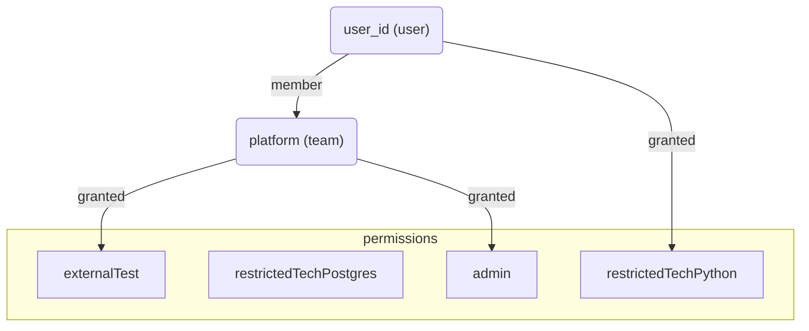

# Permissions

The permission system is a ReBAC (relational) style authorization model.
Permissions are models as series of relationships between a subject and a resource.

These relationships can be connected together into a graph which can be queried in various way,
allowing us to represent complex permission models with a simple, uniform data model.
Having one record per relationship means we can make changes in a safe, atomic way without the need for transactions or denormalization.

## Terminology

Subject - The identifier of _who_ has a relationship to a resource (e.g. a user)
Relation - The kind of relation represented (e.g. membership of a team, grantee of a permission)
Resource - The identifier of what the subject relates to (e.g. team, permission)

Scopes - Permissions granted to a user in the portal (e.g. `permission:admin`)
Permission - A fixed set of permissions or roles that can be granted to users

## General Relationships

The `relationships` collection contains one document per relationship.

```
{
  "subject": (string) who the relationship applies to.
  "subjectType": (string) user|team
  "relation": (string) the relation between subject and resource
  "resource": (string) what the relationship is applied to
  "resourceType": (string) user|team|permission
}
```

Adding a new relationship is simply a matter of inserting a new record.
A relationship can be removed by deleting a record.

The system can be used to represent different kinds of relationships.

In CDP Portal we use the following relationships:

```
- member
- granted
- breakglass
- Any other 'member' scoped permission
```

## Team membership

If a user is added to a team we create a new `member` relation:

```
{
  "subject": "$user_id",
  "subjectType": "user",
  "relation": "member",
  "resource": "$team_id",
  "resourceType": "team"
}
```

When finding members of a team we can query the relationship collection where `resource` matches our `teamId` and `relation` is `member` selecting the `subject`.

## Granting Permissions

We can grant permissions to either a user to team by creating a `grated` relationship.
The subject will be either a user or team ID, the relation `member` and the resource the name of the permission/scope.

```
  "subject": "$user_id",
  "subjectType": "user",
  "relation": "granted",
  "resource": "admin",
  "resourceType": "permission"
```

## Permission inheritance

We can model permission inheritance (i.e. a user gets the permissions of the team they belong to) by joining the relationships into a graph.
Taking a single relationship document, we can find any other documents where the `subject` matches our documents `resource`.

Mongo makes this easier via the `$graphlookup` aggregation.

```js
db.collection('relationships').aggregate([
  {
    $match: {
      subject: userId,
      subjectType: 'user'
    }
  },
  {
    $graphLookup: {
      from: 'relationships',
      startWith: '$resource',
      connectFromField: 'resource',
      connectToField: 'subject',
      as: 'path',
      maxDepth: 5
    }
  }
])
```

We can opt to only follow certain `relation` types (for example `member`).



## Scopes for a user

When working out what scopes a user has, we do a `$graphLookup` on the relationship collection.

- Find all the records where `subject == $user_id` and `subjectType == 'user'`.
- Perform a graphLookup joining `resource` to `subject`
- Process the matched documents, mapping the relation & resource to the legacy scope types

This will grant the user permissions that are assigned directly to them as well as any permissions of teams they are members of.
It will also add some legacy scopes such as serviceOwner etc.

## Break glass and member scoped permissions

Member scopes permissions are represented slightly differently. Instead of `relation: granted` and a `resource` pointing to the permission,
we use the `scope id` as the `relation` and set the resource to the `team id` the permission is scoped to.

```
  "subject": "$user_id",
  "subjectType": "user",
  "relation": "breakglass",
  "resource": "platform-team",
  "resourceType": "team"
```

## Time limited permissions

A relationship document can have an optional `start` and `end` date field.
The `end` field is used in the TTL index, once it has expired the relationship will be deleted.
Additional checks are performed in queries to ensure that time limited permissions are only included when they are active.
